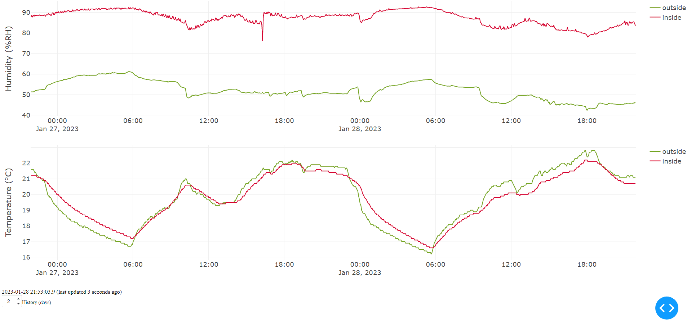
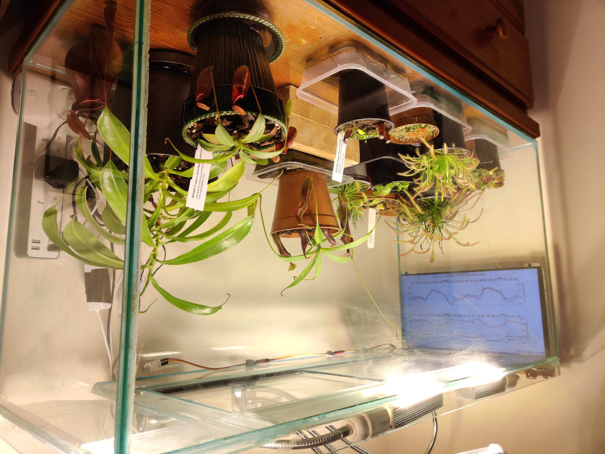

# pi-humidity v2

## Summary

Tool for humidity and temperature logging/visualisation using multiple [Adafruit DHT22 sensors](https://learn.adafruit.com/dht), hosted on a Raspberry Pi 4.

See the [install guide](#install-guide) for instructions on the setup process.

---

## Updates

*Version 2.2*

- Add non-interactive graphs on website subpages for simple/quick access (e.g. from smartphone widget)

*Version 2.1*

- Upgrade production system to use Gunicorn WSGI
- Use thread-safe caching and database calls with multiple worker threads for snappier responses
- Add in-browser configuration options for the graphs

*Version 2.0*

- Upgrade to a docker-based implementation for simple install (tested on a Raspberry Pi 4)
- Use TimescaleDB (time series optimised database, extension of PostgreSQL)
- Improve webpage using the Dash Plotly framework to visualise real-time data
- Generalised to multiple DHT22 sensors
- Automatic SSL certificate generation

*Version 1.0*

- Very lightweight (for use on a low-power Raspberry Pi Zero) implementation which outputs the temperature and humidity graphs as a static image.
- Works with two DHT22 sensors

---

### Example use case

Logging and plotting the inside and outside humidity/temperature of an indoor terrarium that houses environment sensitive Nepenthes plants.

The locally hosted webpage is shown on the Raspberry Pi GUI connected to a screen.

The local website is accessible [remotely](https://pi-humidity.webredirect.org/) on the internet through the use of a dynamic DNS update service (e.g. [dynu](https://www.dynu.com/en-US/)).





---

## Install guide

---

### Physical installation

Connect Adafruit DHT22 sensors to the Raspberry Pi's GPIO pins (see [tutorial on pimylifeup.com](https://pimylifeup.com/raspberry-pi-humidity-sensor-dht22/)).

Note the GPIO pin numbers that the data pins of the DHT22 sensors are connected to for use in the software installation.

---

### Software installation (Raspberry Pi, Raspian [bullseye])

Update

    sudo apt-get update

Install docker

    sudo apt-get remove docker docker-engine docker.io containerd runc
    curl -fsSL https://get.docker.com -o get-docker.sh
    sudo sh get-docker.sh

Clone and ```cd``` into this repository

    git clone git@github.com:Haydeni0/pi-humidity.git
    cd pi-humidity

Run ```./setup.bash``` to

- Set the database password
- Set up initial configuration (including DHT22 sensor names and their corresponding GPIO pins)
- Write default configuration parameters (sensor update)
- Write webserver hostname and email address
  - This is optional, and used to generate an SSL certificate for the website if hosted.

This writes to ```./password.env```, ```./shared/config.yaml``` ```./webserver.env``` respectively, which can be also edited by hand to change parameters.

    ./setup.bash

Run Docker

<details>
<summary>Development notes</summary>

> To build the container use the docker file [```./python.Dockerfile```](./python.Dockerfile)
>
> The build may take a *long* time on a Raspberry Pi, due to many python precompiled wheels not being available for ```arm/v7```.
>
>     docker build -f python.Dockerfile . -t haydeni0/pi-humidity:python
>     docker push haydeni0/pi-humidity:python
>
> > It is recommended to use a faster computer using ```docker buildx build``` to build for ```linux/arm/v7```, and optionally for ```linux/amd64``` to use in development from an amd64 based computer.
> >
> >     docker buildx create --name mybuilder --driver docker-container --bootstrap
> >     docker buildx use mybuilder
> >     docker buildx build -f python.Dockerfile . -t haydeni0/pi-humidity:python --platform linux/arm/v7,linux/amd64

</details>

Use images available on docker hub, specified in the compose file. Run the command:

    docker compose up -d

Now, if the GPIO pins are set correctly, this will display the temperature and humidity graphs to port 80 (using ```http```) of the Raspberry Pi, or port 443 (using ```https```) if there is a valid website hostname specified in ```webserver.env``` that points to the Pi.
This can be seen by entering in the local ip of the Pi into a web browser from a computer on the same LAN, e.g. ```http://192.168.1.123```, ```https://192.168.1.123``` (or ```localhost``` on a browser in the GUI of the Raspberry Pi).

The TimescaleDB database containing the sensor data is accessible on port 5432 of the Raspberry Pi (Username ```postgres``` and password set in ```./password.env```). This also can be accessed through the Raspberry Pi command line with docker (schema and table names defined in ```./config.yaml```)

    docker exec -it pi-humidity-timescaledb /bin/bash -c 'psql -U postgres -d ${POSTGRES_DB}'

    SELECT * FROM dht ORDER BY dtime DESC LIMIT 10;

---

## Database backups

The TimescaleDB database (see [TimescaleDB docs](https://docs.timescale.com/self-hosted/latest/backup-and-restore/pg-dump-and-restore/)) can be dumped to a file by running the script [dump_db.bash](./db_backups/dump_db.bash)

    ./db_backups/dump_db.bash

For more information on how to restore a database from this dump or set up automated backups to Google Drive, read [this](./db_backups/db_backups.md).
